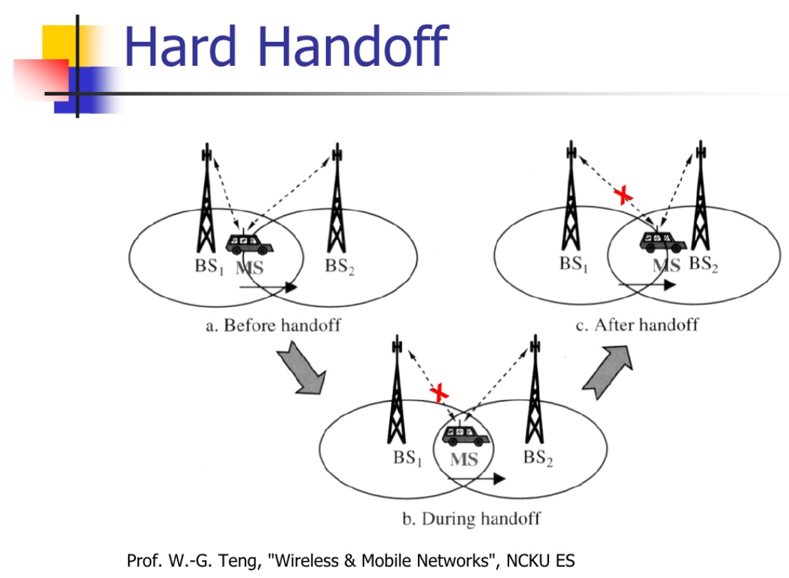

    

    
    
    
    
    
    
    

> 📶 Wiresless network handoff simulator built with python!

This project is a side project of [handoff-visualizer](https://github.com/chonyy/handoff-visualizer).

## Simulation Structure

    

A block size 120 * 80 (m^2). Cars are assummed to be moving on an extremely thin line between blocks, the line doesn't take up any space. The velocity of the car is 10m/s. This means, in our simultation, we iterate once in a second, and the cars moves one node, all the data are calculated every second. We do 86400 iteration to simulate a day.

-   **Velocity** = 36km/hr = 10m/s
-   **Probability of cars entrance** follows [Poisson distribution](https://en.wikipedia.org/wiki/Poisson_distribution)
-   **⋋** = 2 cars/ min [ P(t) = ⋋"e" ^(−"⋋" ) (Hint: t is in sec) ]
-   **Probability of cars turning** based on predefined value listed below
-   **Received Power Calculation** explained below

### Car Entrance Distribution

The probability of the entrance follows [Poisson distribution](https://en.wikipedia.org/wiki/Poisson_distribution) and 

In our simultation

-   **⋋** = 0.0334 cars/ sec
-   **k** = 1

### Received Power

The received power is calculated by the formula below. Read [ScienceDirect](https://www.sciencedirect.com/topics/engineering/received-signal-power) to dig deeper.

-   Base station transmission Pt(mW) = -50 dBm
-   Base = 1mW
-   10log(Pt/Base) = dBm
-   First-meter path loss = 10 dBm
-   **P0 = -50 dBm**
-   **Pd = -50 - 10 - 20log(d(m) / 1m)**

## What is a handoff?

    

## Parameter values

The different parameters for each policy are listed below.

| Parameters |  Value   |
| ---------- | :------: |
| Threshold  | -110 dBm |
| Entrophy   |  5 dBm   |
| Minimum    | -125 dBm |

## Posssibility of turning

The possibility of changing direction when encountering intersection is listed below.

### Intersection with four roads

| Direction   | Possibility |
| ----------- | :---------: |
| Go straight |     1/2     |
| Turn right  |     1/3     |
| Turn left   |     1/6     |